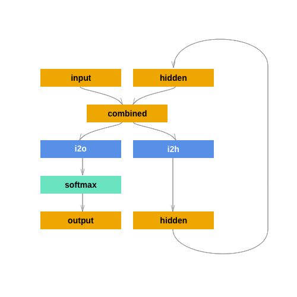

# Clasificación de entidades nombradas con una RNN 🧠
La idea es entrenar una RNN para clasificar entidades nombradas en categorías (**PERSON**, **LOCATION**, **ORGANIZATION**, **OTHER**)

Para crear y entrenar la RNN nos basamos en un tutorial de [Patrick Loeber](https://www.youtube.com/watch?v=WEV61GmmPrk), a su vez basado en este blog de [pytorch.org](https://pytorch.org/tutorials/intermediate/char_rnn_classification_tutorial.html)

Para armar el dataset, escribimos ejemplos de cada categoría y generamos el resto con GPT 3.5 (ChatGPT free).

## Proceso
- Armar dataset de categorías **PERSON**, **LOCATION**, **ORGANIZATION**, **OTHER** usando ChatGPT
- Cargar el dataset en este Colab
- Normalizar dataset
- Definimos el encoding del input (en este caso, usamos _one-hot_)
- Definimos la clase RNN con su _forward pass_ en base a la imagen (1)
- Instanciamos un modelo y hacemos un paso de entrenamiento manualmente
- Seteamos hiperparámetros y entrenamos el modelo
- Probamos el modelo con datos nuevos

*imagen 1, [link](https://pytorch.org/tutorials/intermediate/char_rnn_classification_tutorial.html)*

## Hyperparameters
El modelo se entrenó en `n_iters = 50000`,  `learning_rate = 0.001`, `n_hidden = 128`.

## Importante ❗
Este cuaderno sólo fue testeado en Google Colab. 

El código se conecta a Google Drive y busca la carpeta `My Drive/nn-category-classification/training-data`, donde debe haber un archivo para cada categoría (person, location, organization) conteniendo los datos de entrenamiento. 

Pueden obtener usar los mismos datos que yo, copiá [esta carpeta](https://drive.google.com/drive/folders/1N4FA62g0iQAnIEg0I84xHip02sX10lGx?usp=sharing) a tu carpeta prinicipal (My Drive) de Google Drive. 